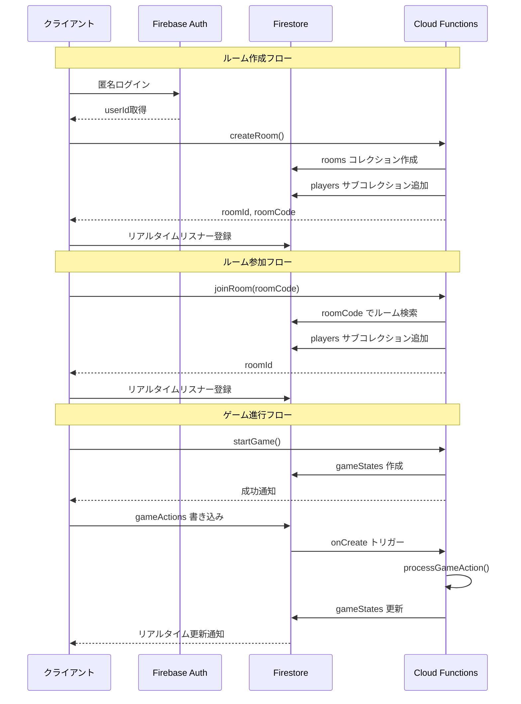

# Firebase ルーム対戦機能 実装計画

## 概要

Firebaseを使用した完全なオンラインマルチプレイ機能を実装します。ローカルで動作しているTestmodeの仕組みを活用しながら、Firebaseと連携したルーム対戦機能を段階的に構築します。---

## フェーズ1: Firebase環境構築とパッケージセットアップ

### 1.1 依存パッケージの追加・変更

- `@supabase/supabase-js` を削除し、Firebase関連パッケージを追加
- `@react-native-firebase/app`
- `@react-native-firebase/auth` (匿名認証用)
- `@react-native-firebase/firestore` (データベース)
- `@react-native-firebase/functions` (Cloud Functions呼び出し)
- Expo Go での実行制約を考慮し、`firebase` (Web SDK) を使用する選択肢も検討

### 1.2 Firebase設定ファイルの作成

- [`src/config/firebase.ts`](src/config/firebase.ts) を作成
- Firebase初期化コード
- Firestore、Auth、Functions のインスタンス取得
- 環境変数による設定の読み込み
- `.env` または `app.json` にFirebase設定を追加

### 1.3 Firebaseプロジェクトのセットアップ手順書

- Firebaseコンソールでプロジェクト作成
- iOSアプリ・Androidアプリの追加
- Anonymous Authentication の有効化
- Firestoreデータベースの作成（us-central1リージョン推奨）

---

## フェーズ2: 認証機能の実装

### 2.1 認証コンテキストの作成

- [`src/contexts/AuthContext.tsx`](src/contexts/AuthContext.tsx) を作成
- 匿名ログイン処理
- ユーザー状態の管理 (userId, nickname)
- ニックネーム設定機能
- ローカルストレージ（AsyncStorage）へのニックネーム保存

### 2.2 ユーザー情報の永続化

- `users/{userId}` コレクションへのユーザー情報保存
- 初回起動時の匿名認証自動実行
- ニックネーム未設定時の入力促進

---

## フェーズ3: ルーム管理画面の実装

### 3.1 ルーム作成画面

- [`src/screens/RoomCreate.tsx`](src/screens/RoomCreate.tsx) を作成
- ニックネーム入力フィールド
- 最大人数選択（2〜6人、デフォルト6人）
- ルーム作成ボタン
- Cloud Function `createRoom` の呼び出し
- 4桁の合言葉（roomCode）の取得と表示

### 3.2 ルーム参加画面

- [`src/screens/RoomJoin.tsx`](src/screens/RoomJoin.tsx) を作成
- ニックネーム入力フィールド
- 4桁の合言葉入力UI（4つの入力ボックス）
- 参加ボタン
- Cloud Function `joinRoom` の呼び出し
- エラーハンドリング（ルームが見つからない、満室など）

### 3.3 待機所（Lobby）画面

- [`src/screens/Lobby.tsx`](src/screens/Lobby.tsx) を作成
- 合言葉の表示とクリップボードコピー機能
- 参加者リストのリアルタイム表示
    - プレイヤー名、テーマカラー、準備完了状態
    - 接続状態の表示（接続中/切断中）
- 準備完了ボタン（トグル式）
- ゲーム開始ボタン（ホストのみ、全員準備完了で有効化）
- 退出ボタン（確認ダイアログ付き）
- Firestoreリスナーの設定
    - `rooms/{roomId}` のリアルタイム監視
    - `rooms/{roomId}/players` サブコレクションの監視

### 3.4 ホーム画面の更新

- [`src/screens/HomePage.tsx`](src/screens/HomePage.tsx) を更新
- 「Create Room」ボタンから `RoomCreate` 画面へ遷移
- 「Join Room」ボタンから `RoomJoin` 画面へ遷移
- ナビゲーションスタックへの画面追加

---

## フェーズ4: Firestore データモデルの実装

### 4.1 TypeScript型定義の作成

- [`src/types/firebase.ts`](src/types/firebase.ts) を作成
- `User` 型
- `Room` 型
- `RoomPlayer` 型
- `GameState` 型（Firestore用に拡張）
- `GameAction` 型
- `GameLog` 型

### 4.2 Firestoreヘルパー関数の作成

- [`src/services/firestore.ts`](src/services/firestore.ts) を作成
- ルーム作成・取得・更新・削除
- プレイヤー情報の取得・更新
- ゲーム状態の取得・監視
- リアルタイムリスナーのセットアップ関数

---

## フェーズ5: Cloud Functions の実装

### 5.1 Functions プロジェクトのセットアップ

- `functions/` ディレクトリの作成
- `firebase init functions` の実行
- TypeScript環境の構築
- 必要な依存パッケージのインストール

### 5.2 ルーム管理関数の実装

- [`functions/src/room.ts`](functions/src/room.ts) を作成
- `createRoom`: ルーム作成処理
    - 既存ルームのクリーンアップ
    - ユニークな4桁合言葉の生成
    - `rooms` コレクションへの追加
    - `rooms/{roomId}/players` へのホスト追加
- `joinRoom`: ルーム参加処理
    - 合言葉でルーム検索
    - 人数チェック、重複チェック
    - プレイヤー追加（トランザクション）
    - カラーインデックスの自動割り当て
- `leaveRoom`: ルーム退出処理
    - プレイヤー削除
    - ホスト移譲ロジック
    - 空ルームの削除
- `startGame`: ゲーム開始処理
    - 全員準備完了チェック
    - `gameStates/{roomId}` の作成
    - 初期ゲーム状態の設定

### 5.3 ゲームアクション処理関数の実装

- [`functions/src/gameActions.ts`](functions/src/gameActions.ts) を作成
- `processGameAction`: Firestoreトリガー関数
    - `gameActions` コレクションへの書き込みを監視
    - アクションタイプに応じた処理の振り分け
- 各アクション処理関数の実装
    - `handlePlaceCard`: カード配置
    - `handleReady`: 準備完了
    - `handleBidStart`: 入札開始
    - `handleRaise`: レイズ
    - `handlePass`: パス
    - `handleRevealCard`: カードめくり
    - `handleSelectPenaltyCard`: ペナルティカード選択

### 5.4 接続管理関数の実装

- [`functions/src/connection.ts`](functions/src/connection.ts) を作成
- `checkPlayerConnections`: 定期実行関数（1分ごと）
    - ハートビートタイムアウトチェック（60秒）
    - 切断判定とCPU代行開始
- `checkActionTimeouts`: 定期実行関数（10秒ごと）
    - アクションタイムアウトチェック（30秒）
    - CPU代行アクションの実行

### 5.5 ユーティリティ関数の実装

- [`functions/src/gameLogic.ts`](functions/src/gameLogic.ts)
- 既存の `src/utils/gameLogic.ts` をサーバーサイド用に移植
- Firestoreデータ構造に合わせた調整
- 勝利条件チェック、フェーズ遷移ロジック

---

## フェーズ6: Firestore Security Rules の実装

### 6.1 セキュリティルールの作成

- `firestore.rules` ファイルを作成
- `users` コレクション: 自分のドキュメントのみ読み書き可
- `rooms` コレクション: 認証済みユーザーは読み取り可、ホストのみ削除可
- `rooms/{roomId}/players`: 参加者全員読み取り可、自分のドキュメントのみ書き込み可
- `gameStates`: 参加者全員読み取り可、書き込みは禁止（Functions経由のみ）
- `gameActions`: 参加者のみ作成可、更新・削除は禁止

### 6.2 Firestoreインデックスの作成

- `firestore.indexes.json` ファイルを作成
- `roomCode` の単一フィールドインデックス
- `status` + `expiresAt` の複合インデックス
- `hostId` の単一フィールドインデックス

---

## フェーズ7: ゲームコンテキストの拡張

### 7.1 オンラインモード対応のGameContext改修

- [`src/contexts/GameContext.tsx`](src/contexts/GameContext.tsx) を拡張
- ゲームモードの管理 (`test` | `online`)
- Firestoreリスナーの統合
- `gameStates/{roomId}` の監視
- ローカル状態とFirestore状態の統合管理
- アクション送信関数の追加（`gameActions` コレクションへの書き込み）

### 7.2 オンラインゲームフックの作成

- [`src/hooks/useOnlineGame.ts`](src/hooks/useOnlineGame.ts) を作成
- Firestoreリスナーのセットアップ
- アクション送信処理
- ハートビート送信（30秒ごと）
- 接続状態の管理

---

## フェーズ8: GameScreen のオンライン対応

### 8.1 GameScreenの改修

- [`src/screens/GameScreen.tsx`](src/screens/GameScreen.tsx) を更新
- ゲームモード（test/online）の判定
- Testmodeでは既存のローカルディスパッチ
- Onlineモードでは `gameActions` への書き込み
- Firestoreからのリアルタイム状態反映
- プレイヤー切り替えUIの出し分け（Testmodeのみ表示）
- 接続状態インジケーターの追加

### 8.2 PlayerSelectorの条件表示

- [`src/components/ui/PlayerSelector.tsx`](src/components/ui/PlayerSelector.tsx)
- Testmodeのみ表示されるように制御
- Onlineモードでは非表示

---

## フェーズ9: CPU代行機能の実装

### 9.1 CPU代行ロジック

- [`functions/src/cpu.ts`](functions/src/cpu.ts) を作成
- `executeCPUAction`: CPU代行アクション実行
    - フェーズに応じたランダムアクション生成
    - `round_setup`: 自動で準備完了
    - `placement`: ランダムにカード配置 or 入札開始
    - `bidding`: 自動パス
    - `resolution`: ランダムにカードめくり
    - `penalty`: ランダムにカード選択

---

## フェーズ10: エラーハンドリングと UI改善

### 10.1 エラーハンドリングの追加

- 全画面・全関数に適切なエラーハンドリングを追加
- トースト通知の実装（`react-native-toast-message` 等）
- ローディング状態の表示
- ネットワークエラーの検知と再接続処理

### 10.2 UIフィードバックの強化

- アクション送信時のローディング表示
- 接続状態のビジュアルインジケーター
- タイムアウトまでの残り時間表示（オプション）

---

## フェーズ11: テストとデバッグ

### 11.1 ローカルエミュレーターでのテスト

- Firebase Emulator Suite のセットアップ
- Firestore、Functions、Authエミュレーターの起動
- エミュレーター接続への切り替え機能

### 11.2 複数端末でのテスト

- 2台以上の端末でルーム作成・参加のテスト
- ゲーム進行のリアルタイム同期確認
- 切断・再接続のテスト
- CPU代行の動作確認

---

## フェーズ12: デプロイとクリーンアップ

### 12.1 Cloud Functionsのデプロイ

- `firebase deploy --only functions` の実行
- 本番環境への反映確認

### 12.2 Firestore Rules とIndexesのデプロイ

- `firebase deploy --only firestore` の実行
- セキュリティルールの検証

### 12.3 不要ファイルの削除

- `@supabase/supabase-js` のアンインストール
- 不要な設定ファイルの削除

---

## データフロー図

---

## 実装の注意点

### Expo Go の制約

- Expo Goでは `@react-native-firebase` パッケージが使用できない
- **Web SDK (`firebase`)** を使用する必要がある
- または、EAS Buildで開発ビルドを作成する必要がある

### セキュリティ

- ゲームロジックは全てCloud Functionsで実行
- クライアントから `gameStates` への直接書き込みは禁止
- セキュリティルールで厳格に権限管理

### パフォーマンス

- Firestoreリスナーの適切な登録・解除
- 不要な読み取りを避けるためのクエリ最適化
- Cloud Functionsのコールドスタート対策

### コスト最適化

- ルームの自動削除（24時間後）
- ログの件数制限（100件まで）
- 定期実行関数の実行頻度調整

---